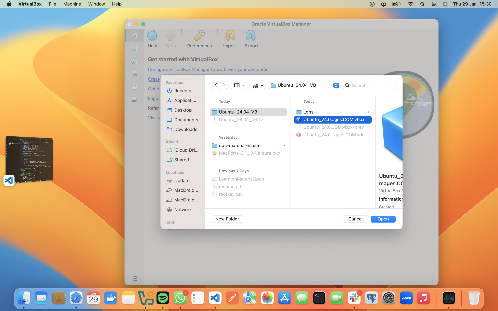

## Lab 01-INFRA: Virtual Machine Installation

**Objective:** Install and configure a Linux Virtual Machine (Ubuntu 24.04 LTS) using Oracle VirtualBox on a macOS host.

---

### Part 1: Prepare Host Computer

* **Install VirtualBox:** Downloaded and installed VirtualBox for **Intel hosts**.
* **Resource Allocation:**
* **RAM:** 4096 MB (4 GB).
* **CPU:** 2 Processors (Optimized for 2017 Dual-Core i5).
* **Disk Space:** 20 GB allocated.

---

### Part 2: Import and Configure VM

* **Add Virtual Machine:** Since the image was provided as a `.vbox` configuration and `.vdi` disk, the **Machine > Add** method was used instead of "Import Appliance".
* **Registration:** Selected `Ubuntu_24.04_VB_LinuxVMImages.COM.vbox` to register the VM.
* **Configuration Note:** The `.vbox` file is **pre-configured**, so manual allocation is not strictly required; however, settings can be adjusted based on your PC's performance.

> **Preview: Locating the .vbox configuration file in the local file system**
> 

* **Launch:** Started the Ubuntu 24.04 LTS instance.

> **Preview: VirtualBox Manager showing the registered VM and confirmed hardware specifications**
> 

> **Preview: VirtualBox window showing the Ubuntu 24.04 LTS boot screen**
> 

---

### Part 3: Verification

* **Terminal Access:** Opened the terminal application within the guest OS.
* **IP Identification:** Executed the following command to determine the network address:
`ip address`

> **Expected Output: Ubuntu Terminal window displaying the output of the 'ip address' command**
> 
---
