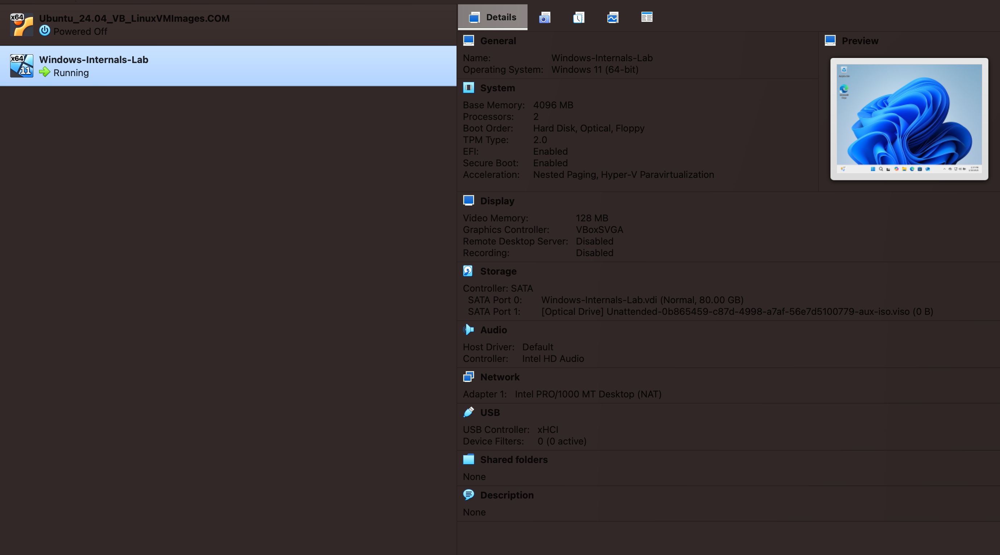
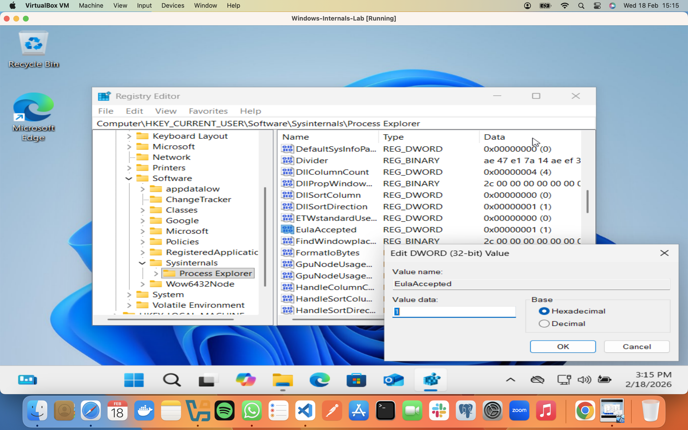

## Lab 02-INFRA: Windows Internals

**Objective:** Explore and analyze Windows processes, threads, handles, and the Windows Registry using the Sysinternals Suite in a virtualized environment.

---

### Part 1: Prepare Host and VM Environment

* **VirtualBox Configuration:** Configured a Windows 11 VM on a macOS host.
* **Troubleshooting:** Resolved naming and pathing "collisions" by using a unique VM name (`Windows-Internals-Lab`) and selecting the correct ISO image.
* **Resource Allocation:**
* **RAM:** 4096 MB (4 GB).
* **CPU:** 2 Processors (Optimized for 2017 MacBook Pro).
* **Security:** Enabled TPM 2.0 and EFI for Windows 11 compatibility.

> **Preview: VirtualBox Manager showing the registered VM and hardware specifications**
> 

---

### Part 2: Process and Thread Analysis

* **Tool Deployment:** Downloaded and extracted the Sysinternals Suite; launched `procexp.exe` with Administrator privileges.
* **Hierarchy Identification:** Utilized the "Find Window" tool to map the relationship between `explorer.exe`, `cmd.exe`, and `conhost.exe`.
* **Dynamic Monitoring:** Observed the creation of `PING.EXE` as a child process when executing a network command in the terminal.

> **Preview: Process Explorer showing the parent-child relationship between cmd.exe and PING.EXE**
> 
> 

* **Execution Units:** Inspected the **Threads** tab of the `conhost.exe` properties to view TIDs and cycle deltas.
* **Resource Handles:** Enabled the **Lower Pane View** to identify specific files and registry keys accessed by the process.

> **Preview: Side-by-side view of active Threads and Handles for the console host**
> 

---

### Part 3: Windows Registry Modification

* **Registry Navigation:** Opened `regedit.exe` and navigated to the user-specific software path for Sysinternals.
* **Artifact Modification:** Located the `EulaAccepted` key, which was initially set to **1** (accepted).
* **Verification:** Changed the value to **0** to test persistence.
* **Result:** Upon restarting Process Explorer, the EULA prompt reappeared, confirming the application's dependence on the registry for configuration data.

> **Preview: Registry Editor showing the EulaAccepted value modification**
> 

---
