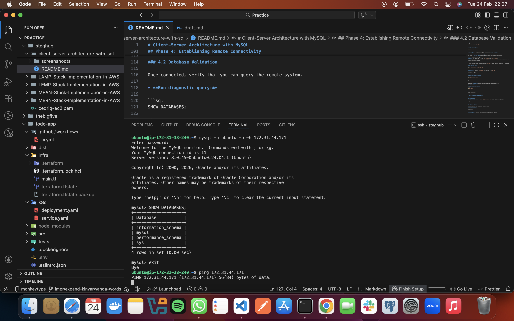

# Client-Server Architecture in Linux Environments

## 1. Core Learning Points

Through this study and practical lab, I have explored the fundamental relationship between clients and servers in a distributed system.

* **Architectural Roles:** I learned that the **Server** is a high-availability host that "listens" for requests and manages centralized resources (like a MySQL database), while the **Client** is the service consumer that initiates communication.
* **Linux Service Management:** I practiced using `systemctl` to manage background daemons. In Linux, a server is essentially a process (like `mysqld`) that remains active to handle incoming network packets.
* **Network Security & Scoping:** I explored the importance of **Firewalls (Security Groups)** and **Bind Addresses**. I learned that even if a service is running, it must be explicitly told to listen on a network interface (`0.0.0.0`) rather than just the local loopback (`127.0.0.1`).
* **Decoupling Services:** By separating the database client from the server, I realized how modern applications scale. One database server can serve multiple client instances, improving resource efficiency.

---

## 2. Practical Implementation: MySQL Remote Connectivity Lab

### Project Overview

This project demonstrates the implementation of a **Client-Server Architecture** using two remote AWS EC2 instances. One instance is configured as a dedicated **Database Server** running MySQL, and the other acts as a **Database Client**. This setup provides hands-on experience with remote database connectivity, networking security, and firewall configuration.

### Phase 1: Provisioning the Compute Instances

To demonstrate remote communication, we require two distinct virtual environments within the same network.

* **Launch Instance A (DB Server):** Name this instance `mysql server`.
* **Launch Instance B (Client):** Name this instance `mysql client`.
* **AMI:** Ubuntu 24.04 LTS for both.

> **Metadata:** Take note of the **Private IP Address** of your `mysql client`. You will use this to restrict database access for maximum security.

### Phase 2: Database Server Configuration

In this phase, we install the MySQL engine on **Server A** and configure it to accept requests from our client.

#### 2.1 Installation

```bash
sudo apt update && sudo apt upgrade -y
sudo apt install mysql-server -y
sudo systemctl status mysql

```

#### 2.2 Security Group Configuration (Port 3306)

MySQL listens on **TCP Port 3306** by default. We must "open the door" in the AWS Security Group.

* **Source:** Enter the **Private IP of the `mysql client**` (e.g., `172.31.x.x/32`). This ensures only our specific client can attempt a connection.

#### 2.3 Enabling Remote Access (bind-address)

Modify the configuration to listen on all network interfaces:

```bash
sudo vi /etc/mysql/mysql.conf.d/mysqld.cnf
# Change bind-address to 0.0.0.0
sudo systemctl restart mysql

```

#### 2.4 Administrative User Configuration

MySQL blocks remote access for the default root user for security. We must create a user authorized for remote connections.

```sql
CREATE USER 'ubuntu'@'%' IDENTIFIED BY 'your_password_here';
GRANT ALL PRIVILEGES ON *.* TO 'ubuntu'@'%' WITH GRANT OPTION;
FLUSH PRIVILEGES;

```
### Phase 3: Client Machine Configuration

We prepare **Server B** to act as the client.

```bash
sudo apt update
sudo apt install mysql-client -y

```

> **Note:** The client machine does not need the full `mysql-server` package, only the `mysql-client` tool to communicate with the remote engine.

---

## Phase 4: Establishing Remote Connectivity

In this final phase, we use the client utility on **Server B** to log into the database engine on **Server A**.

### 4.1 Remote Login

* **Run the connection command:** Replace `<DB_Server_Private_IP>` with the actual private IP of Server A.

```bash
mysql -u root -p -h <DB_Server_Private_IP>

```

### 4.2 Database Validation

Once connected, verify that you can query the remote system.

* **Run diagnostic query:**

```sql
SHOW DATABASES;

```

> **Expected Output:** You should see a table listing the default system databases.
> 
---